<p align="center">
  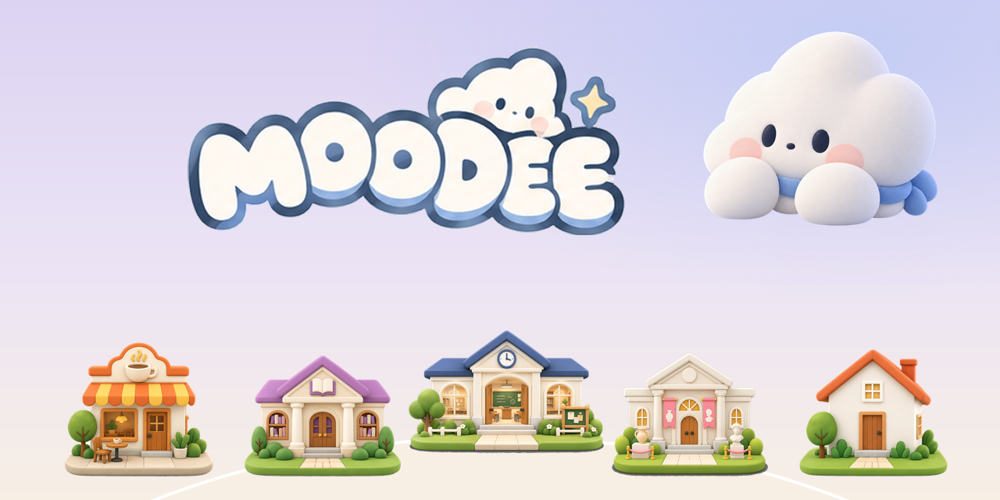
</p>

<h1 align="center">MOODEE</h1>

<p align="center">
  <b>A cozy world for distracted minds.</b><br />
  Pick the place that fits your mood, walk in with your Cloudee, and focus, write, remember, or simply be around people.
</p>

<p align="center">
  <a href="https://i0kyung.github.io/moodee/"><b>▶ Try the web demo</b></a>
  &nbsp;·&nbsp; Mobile first (390 × 844) · Works on desktop in a phone frame
</p>

---

## Five places, five moods

| | Place | Mood | What you do there |
|:-:|---|---|---|
|  | **Classroom** | Focus quietly with others | Walk to a seat, sit down, set the sounds, pick what you are studying, and focus next to other Cloudees. Minimap, light chat, ambient sound icons. |
| 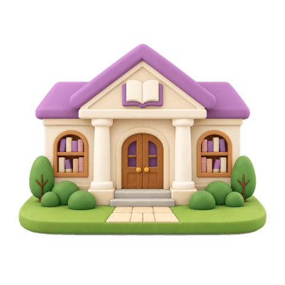 | **Library** | Give your thoughts somewhere to stay | Sit at a desk, open the book, and write straight onto the page. Thoughts you set down in the Classroom land here too. |
|  | **Museum** | Turn moments into memories | Capture a moment with the camera, watch it become a memory object, and place it on a pedestal you can walk back to. |
| 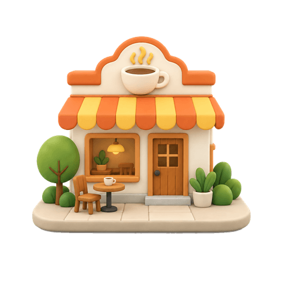 | **Café** | Meet, make something, or simply stay | Make a drink at the counter, carry it to a table, and play a cozy co-op board game with Luna and Hieu. |
| 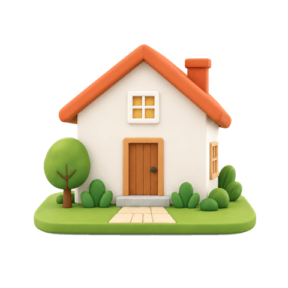 | **My Room** | Make this place feel like yours | Place the things you collected on your desk and shelves, and dress your Cloudee from the wardrobe. |

Every place starts from a top view: walk your Cloudee (stick, WASD, or tap the floor), step up to something, and the scene opens into that activity.

## Meet the Cloudees

<p>
  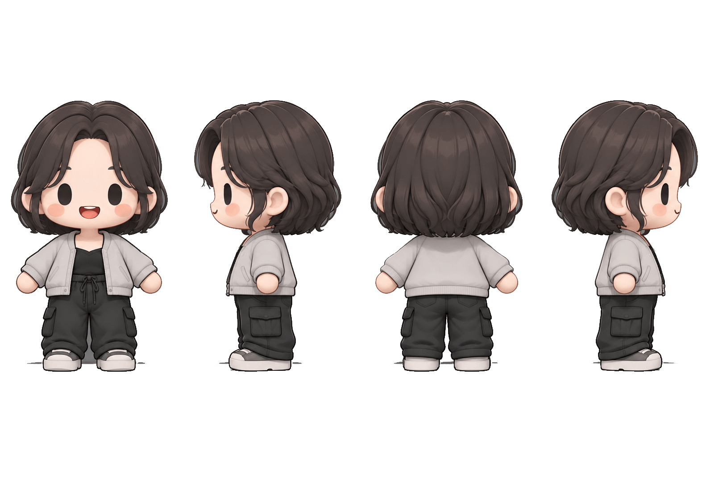
  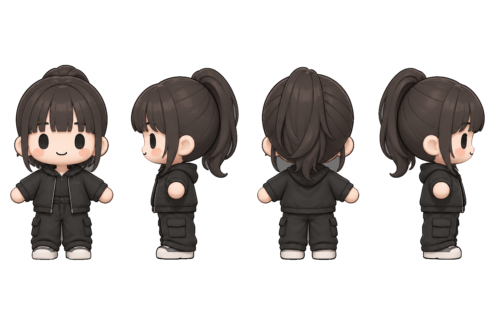
  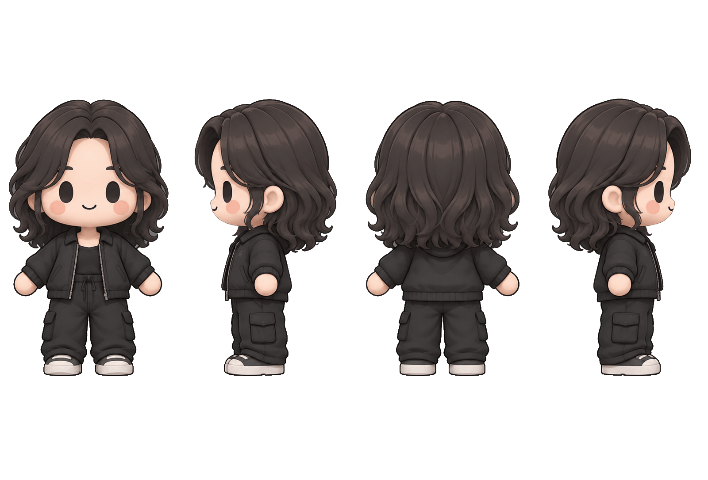
  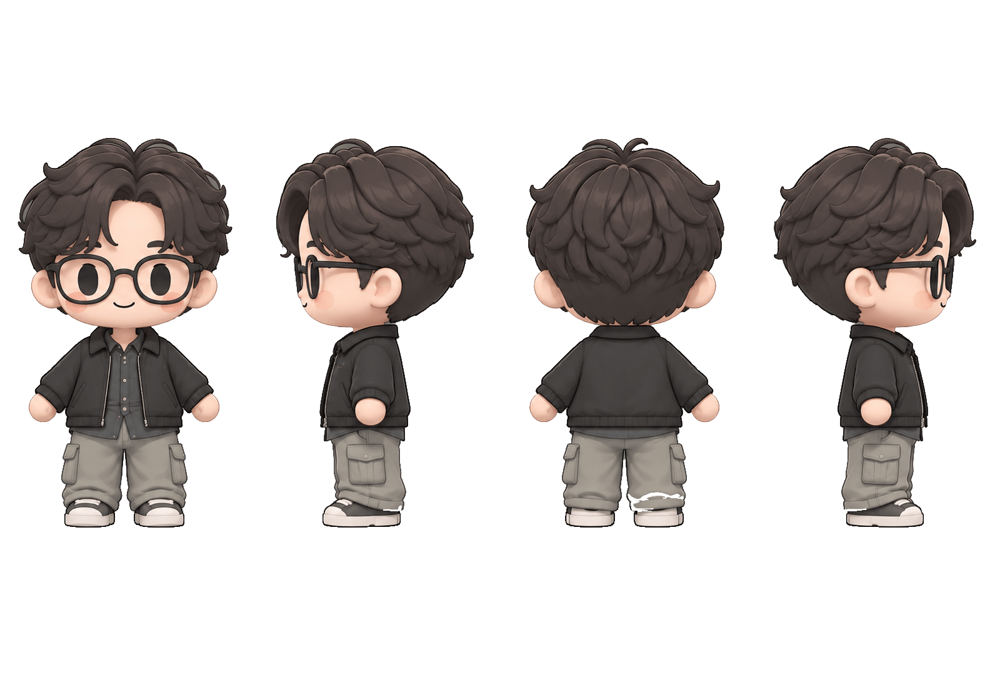
  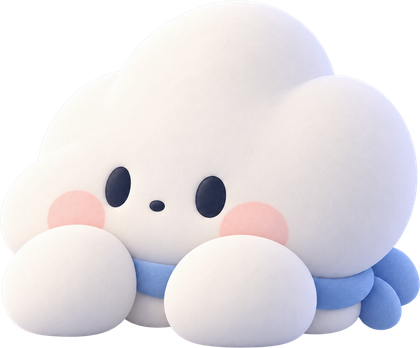
</p>

**Dahyeon · Minkyung · Nier · Nazwan** are free to play. **Cloudy**, the MOODEE cloud, comes with MOODEE PRO — and visits the world as a friend when four friends join you.

## Café: drinks and Board Café

<p>
  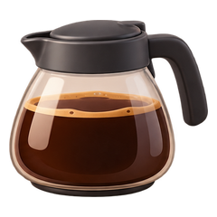
  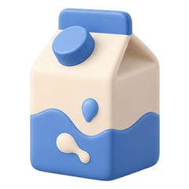
  
  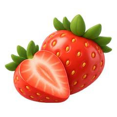
  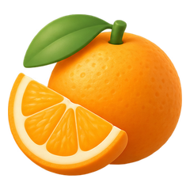
  
</p>

- **Drink maker** — each ingredient pours its own liquid texture into the glass, layer by layer.
- **Cloud Tiles** — a low-pressure co-op tile game: finish three clouds together before the café closes. No losing screen.
- **Word Relay** — last-letter chain in English or Korean (끝말잇기).

<p>
  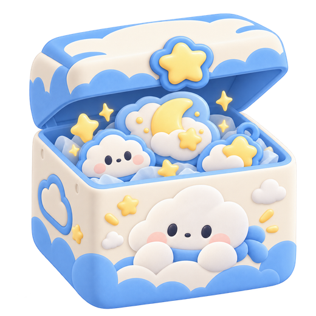
  
  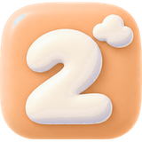
  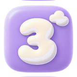
  
  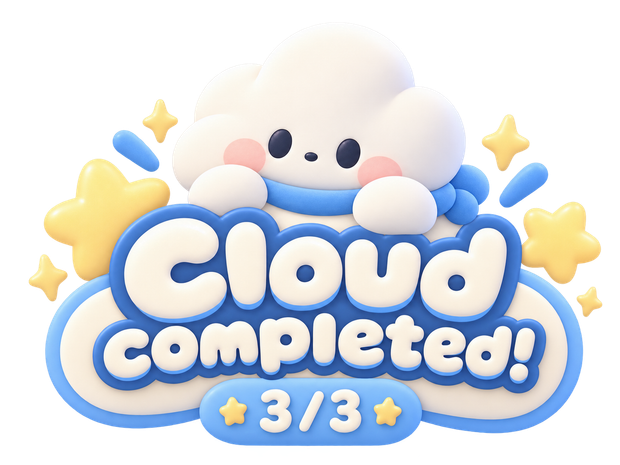
</p>

## Shop & attendance

Finish your first session of the day to light up a stamp on the 7-day board, then claim it in the Shop. Coins unlock outfits; MOODEE PRO adds bigger stamps, monthly outfits, and Cloudy. **Focus features are never behind a paywall.** (Demo only — no payment is taken.)

<p>
  
  
  
</p>

## Principles

- **Calm, not pressure** — no red warnings, no losing screens, sound starts off.
- **Places change the mood** — you don't open a feature, you walk into a place.
- **Together, quietly** — co-presence first; chat is optional and light.

## Run locally

```bash
npm install
npm run dev
```

| Command | What it does |
|---|---|
| `npm run dev` | Start the app |
| `npm run build` | Type-check and build to `dist/` |
| `npm run assets` | Rebuild `public/assets/` from the original artwork (`2026글로벌해커톤/`) |
| `npm run test:rules` | Test the Cloud Tiles pattern rules |

Built with React, TypeScript, Vite, Framer Motion and the Web Audio API. Progress is saved in the browser (localStorage).
Design notes: [`docs/IMPLEMENTATION_PLAN.md`](docs/IMPLEMENTATION_PLAN.md) · [`docs/ASSET_MAP.md`](docs/ASSET_MAP.md)

<p align="center"><sub>MOODEE · 2026 Global Hackathon</sub></p>
